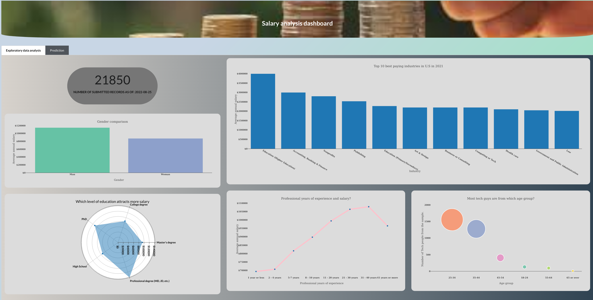

# Salary analysis dashboard    
  
## Background   
The mention of salary sparks a myriad questions in all who are in some kind of employment or who look forward to it. You can with certainty tell that every other learner in some college/high school wants to land in a well paying job, but then, which is that job? There are those in employment who are desiring to get more papers, one of the motivations without a doubt is more salary, again, whats the margin of increment in comparison to perhaps having more years of experience which equally leads to more salary. 
Such are questions that can largely be addressed through data analytics. With data, we can not only have insights into the different factors that inform the differences in salary , but we can also, given those factors, predict what one could potentially earn.    

This tool is could potentially be used in the following areas;
* Mentoring tool for exposing learners to different professions and guiding them.
* Decision tool for those in employment for example it can be used in salary negotiations.
* Organizations in determining salary ranges for recruits/staff. 
* Gender equality proponents in citing cases of inequality in salary.     

The use cases of this platform is really dependent on availability of data and the consistency of data streaming. At the moment I intend to have it serve as a prototype to the end that, with proper support we can scale it up.      

## Data   
The data used in this analysis was obtained from a [Salary Survey](https://www.askamanager.org/2021/04/how-much-money-do-you-make-4.html) done by asamanager.org. 
This is an ongoing survey and the data is streaming in with lapse of time.  From the feedback form the data is fetched to a google sheet from where I obtained the data.   

### Data processing   
The cleaning and wrangling has been done in R and the script for the same is here. The script is part of the a workflow I developed that fetches the data from google sheet every month, processes the data, models it and then saves versions of the model in a board from whence the dashboard gets the cleaned data and model.    
_technical side of things_    
* data.table & dply packages: used for data wrangling.  
* pins library:  used to version the model, with that we can have different versions of the model saved on a board. 

*Note: * The data being collected covers various countries but most submissions are from USA and, for the sake of consistency and modelling, the data was filtered to USA submissions only for now until we have enough submissions from other Countries as well.     

## Modelling    
I used a logistic regression model using the glm package. Using the salary column, the records were split into two categories, those earning <1000000USD/yr and those earning >100000USD/yr. 
Before modelling,  I had to handle an issue of outliers in the response variable using the winsorization approach. I have written an article on that, check it out here.  
I also tried out other models before settling on the logistic model approach. The scripts for the same can be accessed on this folder. 

## Development  (the technical side of things) 
The dashboard has been developed using the below tools, libraries and platforms:    
* R programming software.   
* glm library for modelling.   
* RShiny library for dashboard development.      
* semantic.dashboard framework for the user interface.    
* crontab for scheduling cron jobs that runs the E.T.L pipeline. 
* css for styling the user interface. 
* docker for containerization. 
* heroku : deployment platform.

## Deployment    
Shiny is an package for creating web applications in R. With this library I have created an interface that shows the exploratory data analysis and the prediction using the logistic model.   

### The interface    
The semantic.dashboard library used in creating the interface builds on the Fomantic UI framework for building user interfaces. 
Some bit of styling has been used using css. The script is in the www folder.    

### Exploratory data analysis   
The user interface has two main sections. 
  - Exploratory data analysis. 
  - Prediction      
  
The exploratory data analysis page has visualizations communicating insights from the data. The questions addressed by the analysis are;

   1. Which industry pays the most?     
   2. How does salary increase given years of experience?     
   3. How do salaries compare for the same role in different locations?      
   4. How much do salaries differ by gender and years of experience?      
   5. How do factors like race and education level correlate with salary?       
   
### Prediction   
Using the model from the data workflow, the prediction page has test data set in form of a table that the user tweaks and runs the model with the data for prediction. 
On the page we have model accuracy and how the different variables affect the response variable.    

   

